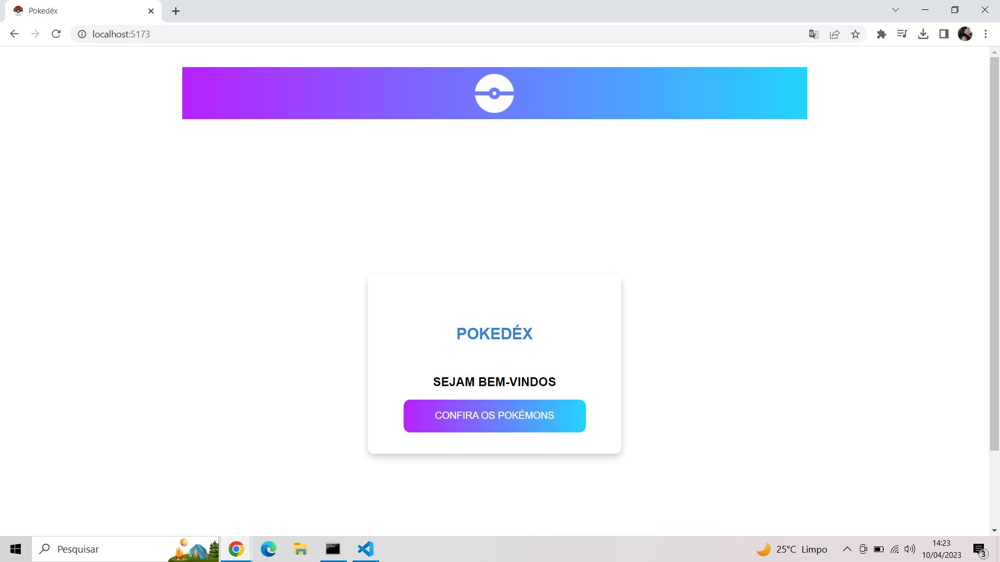
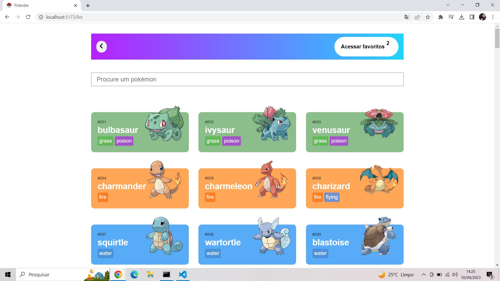
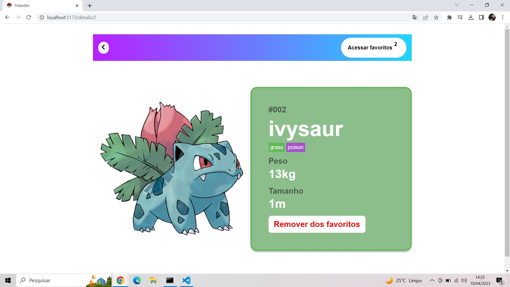
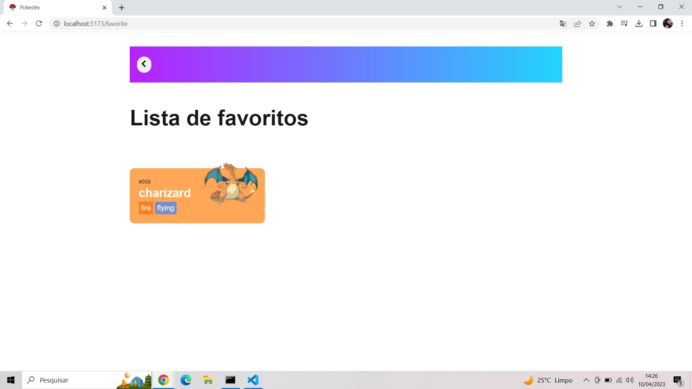

<h1 align="center"> Projeto Via Cep </h1>

<h3> 🚀 Sobre o projeto </h3>

Essa é uma aplicação real desenvolvolvida em React JS, com o create vite, que consulta a API https://pokeapi.co/api/v2/pokemon/ e
liste os resultados para o usuário. Como desejado, ela precisa ter um roteamento simples, feito com React Router, que por sua vez renderiza dois componentes: Home e List. Como efeito de dar uma incrementada na aplicação, duas outras rotas foram criadas: uma para mostrar detalhes de um pokémon específico e outra para listar os favoritos. 

    

    

    

    

<h3> 💻 Tecnologias utilizadas </h3>

### Frontend
    - Vite
    - React Js
    - Styled Components
    - TypeScript
    - Axios
    - Redux Tookilt

## 🔨 Tools
    - Visual Studio Code

## ❓ Installation
#### Antes de tudo, você precisa ter o NodeJs instalado em sua máquina. Com isso, para clonar o projeto via HTTPS, no seu terminal, execute o seguinte comando:
    - git clone https://github.com/JennifferRufino/Pokedex_Teste.git

#### ⚙ Em seguida, entre na pasta do projeto
    - cd Pokedex_teste

#### ⚙ Certifique-se de abrir dois terminais, um para entrar na pasta do frontend e outro para entrar na pasta do backend, rode em cada uma delas
    - pnpm install

## ✔ Run App
#### Basta executar o comando a seguir, tanto na pasta de front, quanto na de back:
    - pnpm run dev

#### Por padrão do Vite, o frontend roda na porta 5173.

                                 With by 🖤 Jenniffer Rufino!